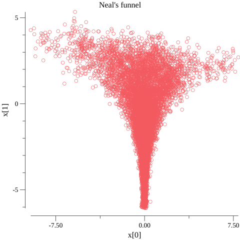

# Neal's funnel

Borrowed from [Stan
examples](https://github.com/stan-dev/example-models/), Neal's
funnel is a model that benefits from reparameterization. A naive
model does not sample well from the funnel's neck:

When reparameterized, which reduces the model to sampling from a
unit Normal, the neck and the shoulders are well explored.

